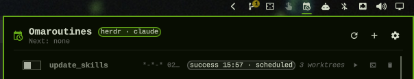
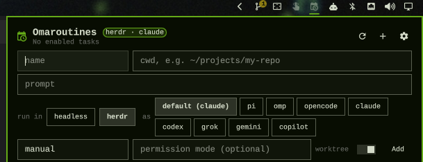

# omaroutines

An [Omarchy](https://omarchy.org) plugin that schedules unattended agent
routines — Claude Code and any other Omarchy agent kind — with a run log,
resumable sessions, and a bar widget. It is the Linux/Hyprland replacement for
Claude Desktop's scheduled-tasks feature: recurring wiki lint passes, literature
watches, data pulls, nightly snapshots.

  

- **Tasks** are a prompt + working directory + optional systemd calendar
  schedule, stored in `~/.local/state/omaroutines/tasks.json`.
- **A one-minute systemd user timer** fires due tasks; missed runs (laptop
  asleep) become a *backlog* you resolve with Run / Skip.
- **Two backends**: `headless` (`claude -p`, resumable with `claude --resume`)
  and `herdr` (a live agent of any supported kind in a hidden background
  [herdr](https://github.com/basecamp/herdr) session you can attach to).
- **Worktree isolation**: each run of a git-repo task gets its own
  `<cwd>/.worktrees/…` branch; unchanged worktrees are removed, changed ones
  are kept for review and pruned once merged.

## Requirements

- Omarchy with `omarchy-shell` (bar widgets / panels) and `systemd --user`
- `jq`, `git`, `systemd-analyze` (schedule validation)
- `claude` on `PATH` for the `headless` backend; `herdr` for the `herdr` backend

## Install

    git clone https://github.com/gumbledore/omaroutines ~/.config/omarchy/plugins/gumbledore.omaroutines
    cd ~/.config/omarchy/plugins/gumbledore.omaroutines && ./install.sh
    omarchy bar put gumbledore.omaroutines --after gumbledore.reminders

`install.sh` symlinks the CLI to `~/.local/bin/omaroutines`, installs and
enables `omaroutines-sweep.timer`, links the plugin if you cloned it elsewhere,
and rescans plugins. `omarchy plugin add https://github.com/gumbledore/omaroutines`
works too — then run `./install.sh` from the plugin folder for the timer and
CLI, which Omarchy's plugin system has no hook for.

## Quick start

    omaroutines add lint-wiki --cwd ~/wiki --schedule "Sun *-*-* 03:00:00" \
      --prompt "Run the lint pass described in CLAUDE.md and open a PR."
    omaroutines trigger lint-wiki       # run it now
    omaroutines log lint-wiki           # run history
    omaroutines resume <run-id>         # pick up that session in a terminal

Or click the bar icon and use **+**:

  

Task names may use letters, digits, `.`, `_`, `-`. A task with `worktree`
on (the default) must point at a git repository; `add`/`edit` refuse
otherwise. Turn it off (`--worktree false`) to run directly in any directory.

## Bar widget and panel

The widget runs `omaroutines list --json` on every change to the state files
and every 60 s:

| State | Icon |
|---|---|
| no enabled tasks | dimmed, tooltip `No enabled tasks` |
| enabled, healthy | normal, tooltip `Next: <task> <when>` |
| failed last run / pending backlog | badge count + active color, tooltip adds `· N failed`, `· N backlog` |
| run in progress | tooltip adds `· N running` |
| CLI missing or failing | plain icon, tooltip `Omaroutines` |

Left-click (or `omaroutines show-overlay`, e.g. bound to a key) opens a panel
under the icon; right-click refreshes. The panel lists every task with its
enable toggle, schedule and next due, last-run outcome, and Trigger / Resume /
Remove buttons; a pending backlog shows Run / Skip. Click a task name to expand
its prompt and run history (Resume or Attach, and Log, per run). Escape, a
second click, or clicking outside closes it.

The chip beside the title shows the current backend and default agent
(`herdr · claude`). The header's **+** opens the add-task form, whose "run in /
as" row picks the backend and then the agent, pinning `--execution`/`--agent`
only where they differ from the defaults; the cog opens `settings.json` or
`tasks.json` in your editor. Editing existing tasks is CLI-only
(`omaroutines edit`).

Runs that changed files keep their worktree (`<cwd>/.worktrees/…`) for review;
opening the panel prunes the ones whose branch has since been merged
(`omaroutines prune` does the same from a shell). Nothing is deleted by age.

## CLI

    omaroutines add <name> --prompt <text> --cwd <dir> [--schedule <expr>|manual]
                            [--permission-mode <mode>] [--worktree true|false]
                            [--agent <kind>] [--execution headless|herdr] [--herdr-timeout <min>]
    omaroutines edit <name> [--prompt ...] [--cwd ...] [--schedule ...]
                            [--permission-mode <mode>|none] [--worktree true|false]
                            [--agent <kind>|none] [--execution ...|none] [--herdr-timeout <min>|none]
    omaroutines settings [get <key> | set <key> <value>]
    omaroutines list [--json]           list tasks
    omaroutines rm <name>               remove a task
    omaroutines enable|disable <name>
    omaroutines trigger <name>          run now
    omaroutines sweep                   fire due tasks (called by the timer)
    omaroutines backlog run|skip <name> resolve a pending backlog notification
    omaroutines log <name> [--json]     show a task's run history
    omaroutines resume <run-id> [--terminal]   resume a headless run's Claude session
    omaroutines attach <run-id> [--terminal]   attach to a herdr run's pane
    omaroutines prune                   remove kept worktrees whose branch is merged
    omaroutines show-overlay            open the task panel

Schedules are systemd calendar expressions (`daily`, `Mon..Fri 09:00`,
`*-*-01 06:00:00`, …), validated with `systemd-analyze calendar`. The default
is `manual` (never fires on its own). The CLI is the sole writer of the JSON
state; the widget, panel, and timer all go through it.

## Backends and agents

Every run resolves an **agent kind** (task `--agent` → `settings.json`
`agent` → `omarchy default agent`; nothing set = the run fails with
`invalid_config`) and an **execution** backend (task `--execution` →
`settings.json` `execution`):

- `headless` (default) — `claude -p`, exit code = outcome, `claude --resume`
  from the panel. Claude only; `headless` with any other kind is rejected at
  `add`/`edit`/`settings set` and again at fire time.
- `herdr` — the run is a live agent (any herdr-supported Omarchy kind except
  crush) in a new tab of a hidden **background herdr session** named
  `omaroutines`. The sweep starts + enables `omaroutines-herdr.service` on
  the first such run and leaves it up. The prompt is submitted with
  `--wait`; `done`/`idle` → success, `blocked` → `failure · blocked`,
  still working at `herdr_timeout_minutes` → `failure · timeout`, agent gone
  → `failure · exited`. The pane stays alive either way; the panel's Resume
  button becomes **Attach** (red when blocked) and `omaroutines attach
  <run-id>` does the same from a shell. The three newest panes per task are
  kept (`herdr_retain`); older settled ones are closed. Agents launch in
  their unattended mode; the task's `permission_mode` is ignored. The herdr
  agent is named `<task>-<run-id>`, lower-cased and trimmed to herdr's rules.

Settings live in `~/.config/omaroutines/settings.json` (merged over
`defaults/settings.json`): `execution`, `agent`, `herdr_session` (`default`
= your foreground herdr), `herdr_retain`, `herdr_timeout_minutes`.

    omaroutines settings                       # show
    omaroutines settings set execution herdr   # every non-pinned task -> herdr
    omaroutines edit lint --agent claude --execution headless

## Files

| Path | What |
|---|---|
| `~/.local/state/omaroutines/tasks.json`, `runs.json` | task and run records (CLI is the only writer) |
| `~/.local/state/omaroutines/logs/<run-id>.out` | per-run output / transcript snapshot |
| `~/.config/omaroutines/settings.json` | your settings, merged over `defaults/settings.json` |
| `~/.config/systemd/user/omaroutines-{sweep.timer,sweep.service,herdr.service}` | units linked by `install.sh` |
| `~/.config/herdr/sessions/omaroutines/` | the background herdr session |
| `<cwd>/.worktrees/<task>-<stamp>-<run-id>` | kept per-run worktrees |

## Upgrading from oma-claude-schedule

The project was renamed `omaroutines` (plugin id `gumbledore.omaroutines`).
Running `./install.sh` from this repo migrates automatically: state moves from
`~/.local/state/oma-schedule` to `~/.local/state/omaroutines`, the old
`~/.local/bin/oma-schedule` symlink and `kmg.oma-claude-schedule` plugin
symlink are removed, and the old `oma-schedule-sweep.{timer,service}` /
`oma-schedule-herdr.service` units are disabled and deleted. Re-place the bar
widget under the new id (`omarchy bar put gumbledore.omaroutines …`) and drop
the old `kmg.oma-claude-schedule` entry from your bar config if it is still
referenced there.

## Uninstall

    ./install.sh --uninstall

This disables and removes the `omaroutines-sweep.timer` and
`omaroutines-herdr.service` user units, drops the `~/.local/bin/omaroutines`
and plugin symlinks, and rescans plugins. Do this **before**
`omarchy plugin remove` — removing the plugin folder alone leaves the timer
firing a dead path every minute. Task, run, and log state in
`~/.local/state/omaroutines/` is kept; delete it by hand for a clean slate.
The background herdr session is kept too; remove it with
`herdr session stop omaroutines; herdr session delete omaroutines`. Kept
worktrees under each task's `<cwd>/.worktrees/` are ordinary git worktrees;
`git worktree remove` them if you no longer want them.

## Development

    uv run pytest                              # full suite (fake claude/herdr/systemctl)
    uv run pytest tests/test_qml_smoke.py      # fast inner loop for the panel (offscreen quickshell)
    OMAROUTINES_HERDR_INTEGRATION=1 uv run pytest tests/test_herdr_integration.py   # one real herdr run

Architecture and the reasoning behind each decision are in `docs/design.md`;
`CLAUDE.md` carries the AI-workspace instructions. The plugin directory is a
symlink when installed from a clone elsewhere, and the shell's inotify watch
does not follow it, so QML edits are not hot-reloaded: run
`omarchy restart shell` after editing any QML.

## License

MIT — see `LICENSE`.
